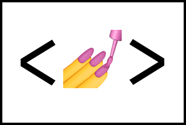

# Entertainment Web

### Table of Contents

- [Prerequisites](#prerequisites)
- [Tech Stack](#Tecg-Stack)
- [Getting Started](#Getting-Started)
- [Project Structure](#Project-Structure)
- [Deployment](#Deployment)
- [Resources](#Resources)

#

### Prerequisites

-  Node JS @16.X and up
-  npm @8 and up
-  Typescript @4 and up

#

### Tech Stack

-  React @18.2.0 - front-end framework
-  Styled Components @5.3.6 - CSS framework
-  Axios @1.2.3 - Promise based HTTP client for the browser and node.js

#

### Getting Started

1. First of all you need to clone app repository from Github :

```
git clone https://github.com/Tusho7/entertainment-web-app-front
```

2. Next step requires install all the dependencies.

```
npm install
```

3. To see project in action

```
npm run start
```

#

### Project Structure

```
|--- src
|   |--- components #  components
|   |--- index.ts # export all components
- package.json     # dependency manager configurations
```

#

### Deployment

Before every deployment you need to create build file.

```
npm run build
```

after this you can use this file to deploy project on server.

#

### Resources

- [Figma](https://www.figma.com/file/QUmtq9p2AePwwK746NEM8s/entertainment-web-app?node-id=0%3A8214&t=BKnYZCGJdlKW9mTo-0)
